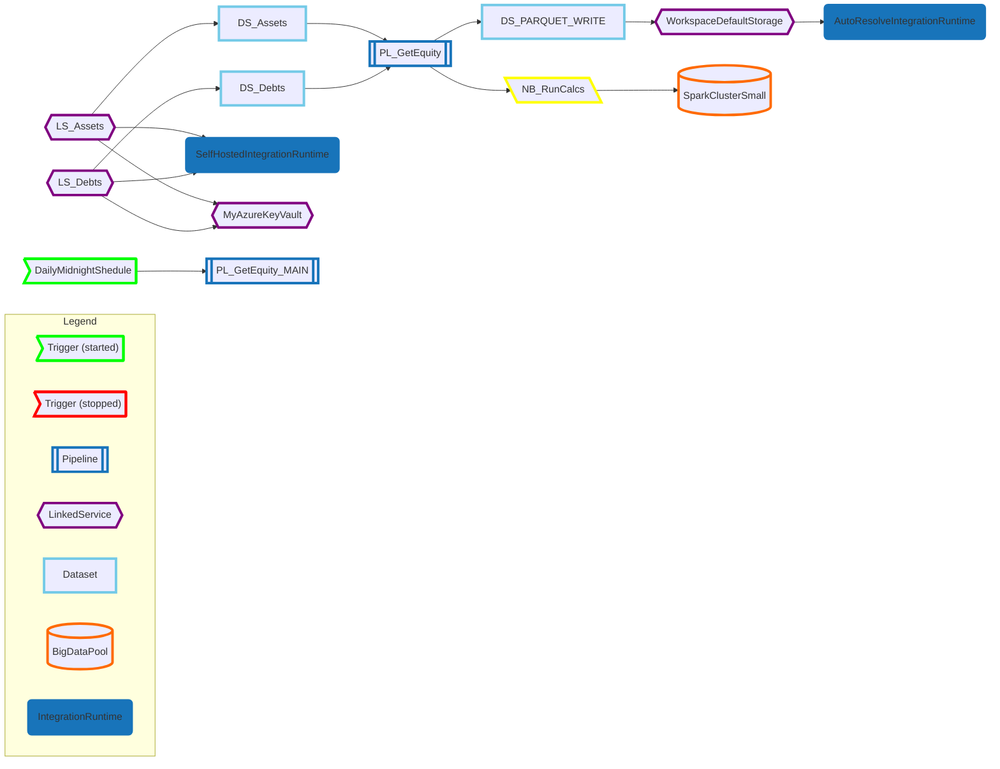

# Synapse Graph Azure DevOps Pipeline Task

Available here in preview on the VisualStudio Marketplace: https://marketplace.visualstudio.com/items?itemName=mark-zhukovsky.synapse-graph-extension

## About
Azure DevOps task to use in your Azure DevOps pipelines to show the dependencies of those OTHER types of pipelines you have in Synapse!

:warning: this task requires Python 3.8

For example, in your Azure DevOps pipeline:
```yml

# this task is required for the synapse-graph-task to work!
- task: UsePythonVersion@0
  inputs:
    versionSpec: '3.8'
    addToPath: true
    architecture: 'x64'

- task: synapse-graph-task@0
  inputs:
    workspace: 'my_synapse_ws'
    synapseDirectory: '$(Build.SourcesDirectory)/synapse'
    artifactStagingDirectory: '$(Build.ArtifactStagingDirectory)/synapsegraph'
    itemTypes: 'Trigger, Pipeline, LinkedService, Dataset, Notebook, SparkJobDefinition, BigDataPool, IntegrationRuntime'
```

e.g. output:



## Todo
But will probably never get around to it - so contributions welcome:

- run the python code in a venv to prevent any potential conflicts
- differentiated arrow colors to make clear various paths to primary pipelines, with dependencies for the same pipeline gradient-shaded
- filtering based on Synapse/ADF virtual folder  (i.e. UI folders, properties.folder.name)
- filtering based on annotations / displaying annotations and/or parameters (e.g. for linkedServices and datasets) on click or taking it further and show separate nodes for each differently parameterized LS/DS/PL objects
- tooltips with the descriptions for each artifact from Synapse (if available in github/ado mermaid markdown, or just switch to a proper library like AntV G6)

## Dev

### Compile TypeScript files
Run ```tsc``` in PS to compile the task ts files to js

### Prepare for packaging
Note each TASK has a package.json that you need to run ```npm install``` on within the task sub-folder and it does need to be included in the vsix. See: https://github.com/microsoft/azure-pipelines-task-lib/issues/485

## Testing

### Locally

Just run ```node synapse_graph_task/synapse_graph_task.js``` in PS

But first set the inputs as env vars in the PS session, e.g.:

```
$env:LOCAL_TEST="true"
$env:INPUT_workspace="synapseWorkspaceName"
$env:INPUT_artifactStagingDirectory="C:\Repos\synapse-graph-devops-ext"
$env:INPUT_synapseDirectory="C:\Repos\synapse-graph-devops-ext\synapse"
```

## Publishing

### Package to VSIX

Be sure to run  ```tsc``` in PS to compile the task ts files to js first then:

```
tfx extension create --manifest-globs vss-extension-manifest.json --rev-version
```

:warning: This increments the PATCH version number of your extension and saves the new version to your manifest. You must rev BOTH the task version (in task.json) AND the extension version. todo: check if there's command to update task patch version as well

todo: automate the above steps

### Publish to Marketplace

Either [manually upload](https://marketplace.visualstudio.com/manage/publishers/mark-zhukovsky) the VSIX generated from above, or can bundle into VSIX and publish in one go instead:

```
tfx extension publish --manifest-globs vss-extension-manifest.json --share-with zhukovsky
```

--share-with is optional, in this case my private VS "organization"

But to share publicly (instead of specific organization) must be a verified publisher.
